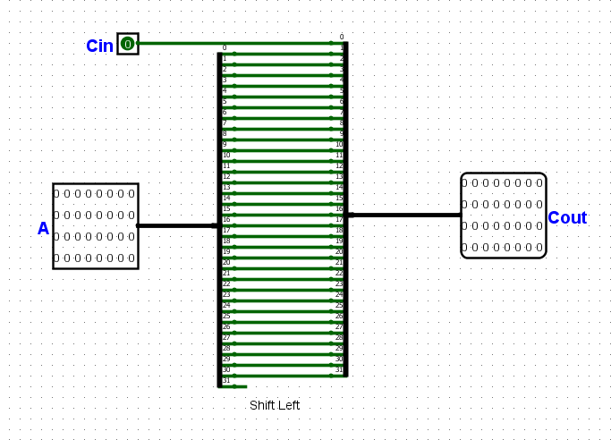
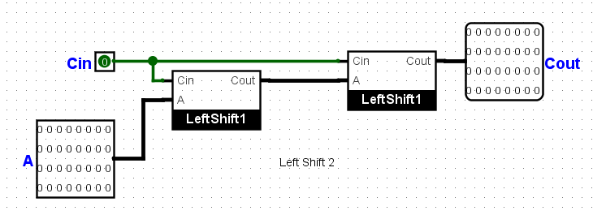
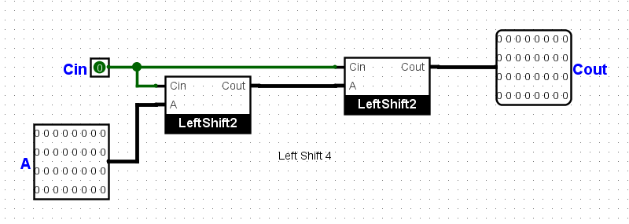
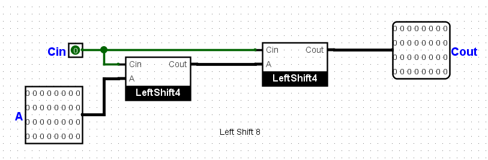
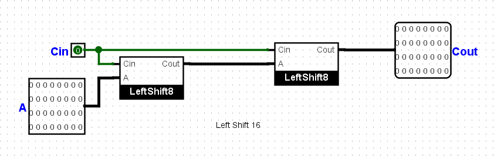
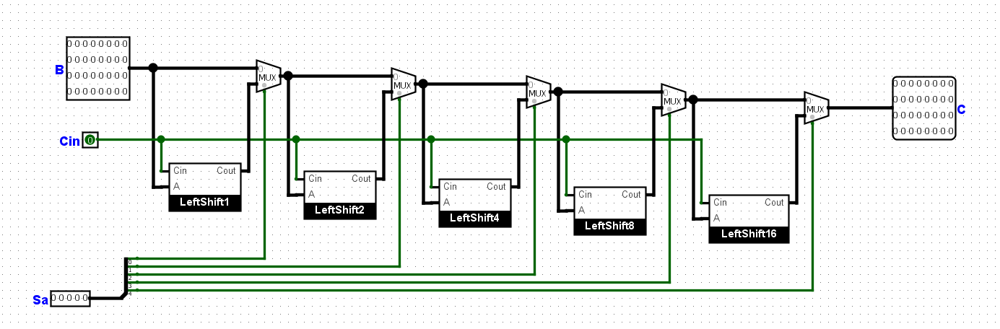
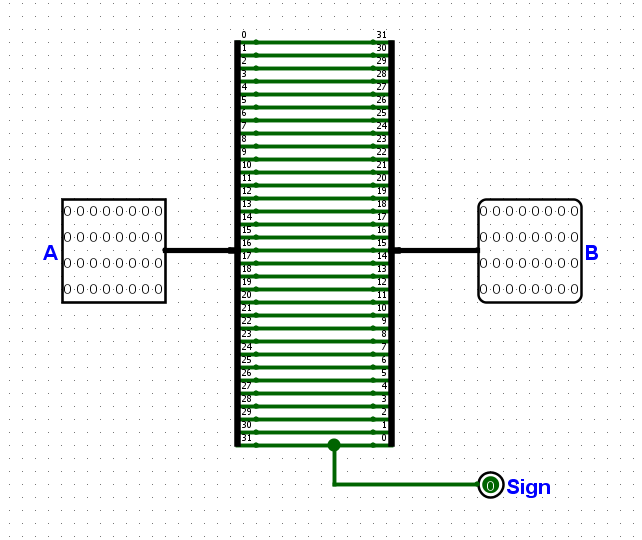
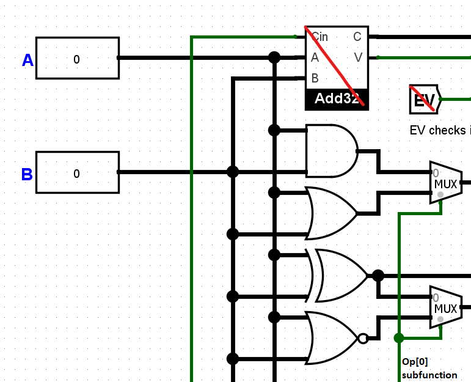
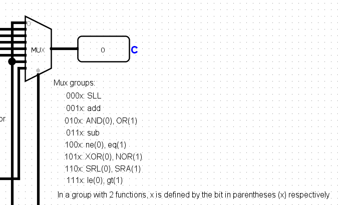

# Project 1 - ALU Design Documentation

## Table of Contents

## Overview

This is a 32-bit ALU which can perform basic operations on 32-bit signed integers. Supported operations include addition/subtraction, shift left/right logical/arithmetic, logic operations AND/OR/XOR/NOR, comparison between 2 numbers and one number with 0.

## ALU Op splitter

The 4-bit Op is splitted into multiple outputs to serve different purposes.

**Notations**:
- Op[x:y]: continuous bit segment from position x to position y (inclusive);
- Op[x1,x2,...,xn]: the output consists of bits Op[x1], Op[x2], ..., Op[xn] to be placed respectively, as a group.

The position of each bit is counted from right to left, starting from 0 (the rightmost/least significant bit is at the position 0).

*Examples*: Op=`0110`, then Op[1:3]=`011`, while Op[0,2]=`10`.

The result of these notations will have its own new positions for each bit, independent of how it was calculated.

**Outputs**:
- Op[1:3]: select master MUX output.
- Op[0,3]: custom Opcode for the LRShift32 circuit.
- Op[2]: Cin value for the Add32 circuit.
- Op[1,3]: to be put through an AND gate to obtain EV signal (to be explained in later parts).
- Op[0]: subfunction bit to differentiate among function groups (to be explained in later parts).

## 32-bit adder/subtractor circuit (Add32)
### a) 1-bit full adder (Add1)

The circuit receives 3 bits A, B, and Cin - the carry-in value from previous 1-bit add/subtract operation.

**Outputs**:
It will output S and Cout - the carry-out value for the next adder.

|A|B|Cin|S|Cout|
|-|-|:-:|-|:--:|
|0|0| 0 |0| 0  |
|0|0| 1 |1| 0  |
|0|1| 0 |1| 0  |
|0|1| 1 |0| 1  |
|1|0| 0 |1| 0  |
|1|0| 1 |0| 1  |
|1|1| 0 |0| 1  |
|1|1| 1 |1| 1  |

### b) 4-bit adder (Add4)

The circuit receives two 4-bit signed integers A and B, a carry-in bit Cin and a control bit Sub. It splits A and B into 4 bits of each, and adds to their respective 1-bit full adder.

In case of subtraction (A - B), B is negated by the XOR gate before going into 1-bit adders. The XOR gate is controlled by the Sub bit.

**Outputs**:
- S: concatenated from four (4) outputs from 1-bit adders.
- Cout: get the carry-out bit from the last bit adder to be carried to the next adder in sequence.
- V: overflow signal of 4-bit adder.

### c) 16-bit adder (Add16)

The circuit receives two 16-bit signed integers A and B, a carry-in bit Cin and a control bit Sub. The architecture is similar to that of a 4-bit adder, but this circuit splits each of A and B into 4 groups of 4 bits.

The subtraction operation is handled internally by the 4-bit adders, and controlled by the bit Sub.

The outputs V from 4-bit adders are discarded, except for the last 4-bit adder for 16-bit adder overflow detection.

**Outputs**:
- S: concatenated from four (4) 4-bit outputs from 4-bit adders.
- Cout: get the carry-out bit from the last bit adder to be carried to the next adder in sequence.
- V: overflow signal of 16-bit adder.

### d) 32-bit adder (Add32)

The 32-bit adder circuit is constructed by stacking two 16-bit adders in sequence. Similar to other adders, this circuit split 32-bit integers A and B into two 16-bit numbers, then adds to their respective 16-bit adders.

**Outputs**:
- C: concatenated from two (2) 16-bit outputs from 16-bit adders.
- V: overflow signal of 32-bit adder.

### e) EV signal
The EV signal receives from the ALU Op splitter 2 bits **Op[1]** and **Op[3]**, then negates **Op[3]** and put these two bits through an AND gate.

|Op[1]|Op[3]|EV|
|:-:|:-:|:-:|
|1|0| 1 |
| Otherwise || 0 |

EV will be put through an AND gate with the V signal from the Add32 circuit to determine whether to enable output V of the ALU.

This signal allows V to be turned on **if and only if** the ALU Op code is addition/subtraction and the result is overflown.

|EV|V_Add32|V_ALU|
|:-:|:-:|:-:|
|0|0| 0 |
|0|1| 0 |
|1|0| 0 |
|1|1| 1 |

### f) Working mechanism
The ALU Op splitter will get these 3 outputs to serve the Add32 circuit:
- Op[1:3]: master MUX output.
- Op[2]: Cin value. 0 if addition, 1 if subtraction.
- Op[1,3]: Input for EV signal.

If Op = `001x` or `011x`, it will send the above respective values to their approriate circuits to function.

If Op = **`001x`**, the master MUX will output the **addition** operation's result.

If Op = **`011x`**, the master MUX will output the **subtraction** operation's result.

Otherwise, the master MUX will **not** output addition/subtraction operation's result.

|Op|Op[1:3] (MUX)|Op[2] (Cin)|(EV)|
|:-:|:-:|:-:|:-:|
|001x|001|0|1|
|011x|011|1|1|
|Otherwise|||0|

## 32-bit shifter (LRShift32)
### a) 1-bit left shifter (LeftShift1)

The base 1-bit left shifter circuit receives two inputs: 32-bit integer **A** and fill-in bit **Cin**.

**A** is splitted into 32 bits using an A-splitter, then joined with another 32-bit Cout-splitter with the pin 31 of A-splitter left unused.

On the other hand, the **Cin** bit is connected to the pin 0 of the Cout-splitter, so that **Cout** is the result of shifting A 1 bit to the left and filled with **Cin**.

### b) 2,4,8,16-bit left shifter (LeftShift2/4/8/16)

These 4 left shifters have the same architecture: A -bit left shifter has two -bit left sub-shifters stacked linearly, with Cin value being fed into both sub-shifters, and the output Cout from the first sub-shifter is the input A of the second one.

### c) 32-bit left shifter (LeftShift32)

This circuit receives 3 inputs: a 32-bit integer **B**, a fill-in bit **Cin**, and an unsigned 5-bit integer **Sa** controlling how many bits to be shifted.

Each bit in **Sa** determines which left shifter to be used. Bit at position  in **Sa** controls the MUX associated with the LeftShift circuit.

Because every integer can be expressed as a sum of powers of 2, this architecture makes left shifting possible with any number of bits from 0 to 31.

### d) Reverse circuit

### e) 32-bit left-right shifter (LRShift32)

## Logic operations

32-bit inputs A and B are put through 4 logic gates AND, OR, XOR, NOR concurrently, then the Op[0] of the ALU determines which output to be chosen in each subgroup:
- AND, OR are in the same group due to similar Op[1:3]=`010`. With Op code `010x`, x=0 picks the AND output, x=1 picks the OR output.
- Similarly, XOR and NOR are in another group with Op[1:3]=`101`. With Op code `101x`, x=0 picks the XOR output while x=1 picks the NOR output.

In each group, a 2-to-1 MUX circuit picks the requested output. The signal bit from Op[0] determines this according to the description of grouping above.

## Comparison circuits

## Master MUX

The master 8-to-1 MUX determines the output of the ALU according to its Op[1:3] value.

Below is the table of MUX groupings:

|Op[1:3]|x|Function|
|:-:|:-:|:-:|
|000|any|shift left logical|
|001|any| add
|010|0| AND|
||1|OR|
|011|any|subtract|
|100|0|ne|
||1|eq|
|101|0|XOR
||1|NOR|
|110|0|shift right logical|
||1|shift right arithmetic|
|111|0|le|
||1|gt|

It should be noted that in the above table, where the Op[1:3] value has 2x explicitly associated to each function, those 2 functions have already belonged to the subcircuit of that Op[1:3] and x determines which function to output for the subcircuit. Therefore, the master MUX will receive exactly 1 output for each Op[1:3] value.