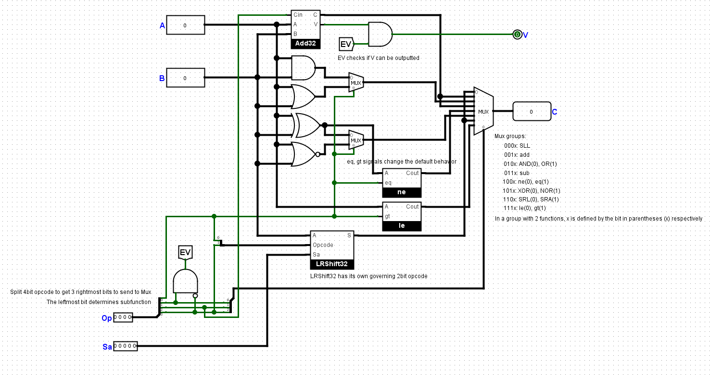
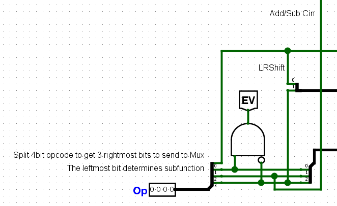
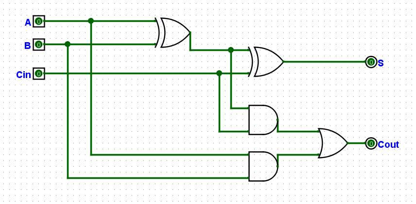
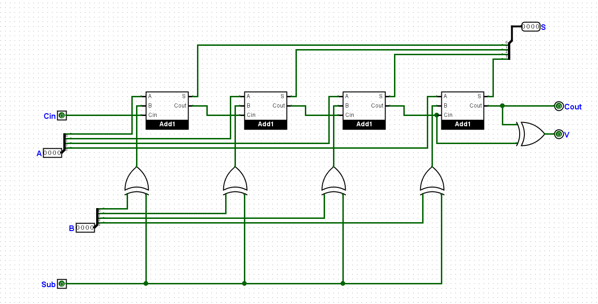
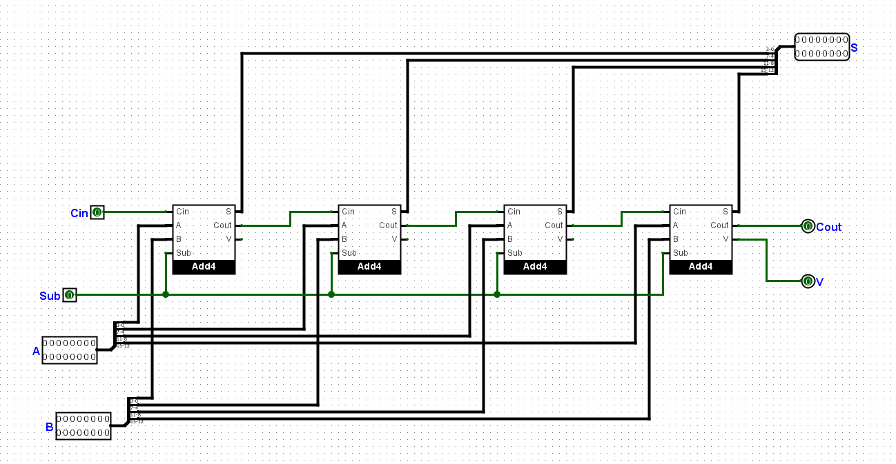
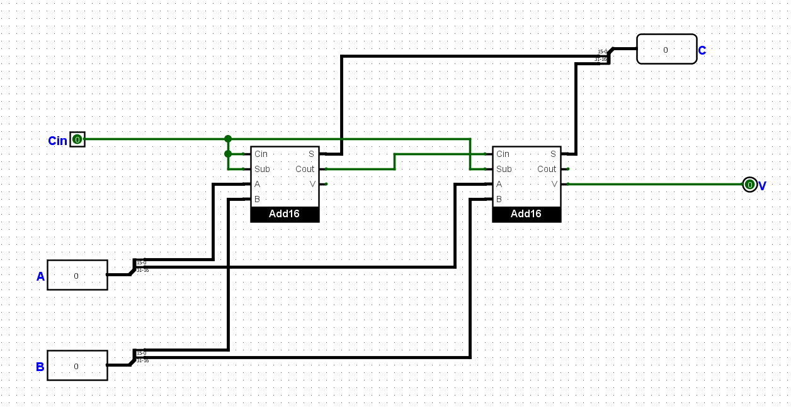
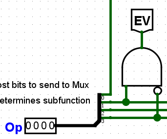
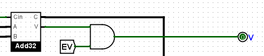

# Project 1 - ALU Design Documentation

## Overview

This is a 32-bit ALU which can perform basic operations on 32-bit signed integers. Supported operations include addition/subtraction, shift left/right logical/arithmetic, logic operations AND/OR/XOR/NOR, comparison between 2 numbers and one number with 0.

## ALU Op splitter

The 4-bit Op is splitted into multiple outputs to serve different purposes.

**Notations**:
- Op[x:y]: continuous bit segment from position x to position y (inclusive);
- Op[x1,x2,...,xn]: the output consists of bits Op[x1], Op[x2], ..., Op[xn] to be placed respectively, as a group.

The result of these notations will have its own new indexes for each bit, independent of how it was calculated.

**Outputs**:
- Op[1:3]: select master MUX output.
- Op[0,3]: custom Opcode for the LRShift32 circuit.
- Op[2]: Cin value for the Add32 circuit.
- Op[1,3]: to be put through an AND gate to obtain EV signal (to be explained in later parts).
- Op[0]: subfunction bit to differentiate among function groups (to be explained in later parts).

## 32-bit adder/subtractor circuit (Add32)
### a) 1-bit full adder (Add1)

The circuit receives 3 bits A, B, and Cin - the carry-in value from previous 1-bit add/subtract operation.

**Outputs**:
It will output S and Cout - the carry-out value for the next adder.

|A|B|Cin|S|Cout|
|-|-|:-:|-|:--:|
|0|0| 0 |0| 0  |
|0|0| 1 |1| 0  |
|0|1| 0 |1| 0  |
|0|1| 1 |0| 1  |
|1|0| 0 |1| 0  |
|1|0| 1 |0| 1  |
|1|1| 0 |0| 1  |
|1|1| 1 |1| 1  |

### b) 4-bit adder (Add4)

The circuit receives two 4-bit signed integers A and B, a carry-in bit Cin and a control bit Sub. It splits A and B into 4 bits of each, and adds to their respective 1-bit full adder.

In case of subtraction (A - B), B is negated by the XOR gate before going into 1-bit adders. The XOR gate is controlled by the Sub bit.

**Outputs**:
- S: concatenated from four (4) outputs from 1-bit adders.
- Cout: get the carry-out bit from the last bit adder to be carried to the next adder in sequence.
- V: overflow signal of 4-bit adder.

### c) 16-bit adder (Add16)

The circuit receives two 16-bit signed integers A and B, a carry-in bit Cin and a control bit Sub. The architecture is similar to that of a 4-bit adder, but this circuit splits each of A and B into 4 groups of 4 bits.

The subtraction operation is handled internally by the 4-bit adders, and controlled by the bit Sub.

The outputs V from 4-bit adders are discarded, except for the last 4-bit adder for 16-bit adder overflow detection.

**Outputs**:
- S: concatenated from four (4) 4-bit outputs from 4-bit adders.
- Cout: get the carry-out bit from the last bit adder to be carried to the next adder in sequence.
- V: overflow signal of 16-bit adder.

### d) 32-bit adder (Add32)

The 32-bit adder circuit is constructed by stacking two 16-bit adders in sequence. Similar to other adders, this circuit split 32-bit integers A and B into two 16-bit numbers, then adds to their respective 16-bit adders.

**Outputs**:
- C: concatenated from two (2) 16-bit outputs from 16-bit adders.
- V: overflow signal of 32-bit adder.

### e) EV signal
The EV signal receives from the ALU Op splitter 2 bits Op[1] and Op[3], then negates Op[3] and put two bits through an AND gate.

|Op[1]|Op[3]|EV|
|:-:|:-:|:-:|
|1|0| 1 |
| Otherwise || 0 |

EV will be put through an AND gate with the V signal from the Add32 circuit to determine whether to enable output V of the ALU.

This signal allows V to be turned on **if and only if** the ALU Op code is addition/subtraction and the result is overflown.

|EV|V_Add32|V_ALU|
|:-:|:-:|:-:|
|0|0| 0 |
|0|1| 0 |
|1|0| 0 |
|1|1| 1 |

### f) Working mechanism
The ALU Op splitter will get these 3 outputs to serve the Add32 circuit:
- Op[1:3]: master MUX output.
- Op[2]: Cin value. 0 if addition, 1 if subtraction.
- Op[1,3]: Input for EV signal.

If Op = `001x` or `011x`, it will send the above respective values to their approriate circuits to function.

If Op = **`001x`**, the master MUX will output the **addition** operation's result.

If Op = **`011x`**, the master MUX will output the **subtraction** operation's result.

Otherwise, the master MUX will **not** output addition/subtraction operation's result.

|Op|Op[1:3] (MUX)|Op[2] (Cin)|(EV)|
|-|:-:|:-:|:-:|
|001x|001|0|1|
|011x|011|1|1|

## 32-bit shifter (LRShift32)

## Logic operations

## Comparison operations